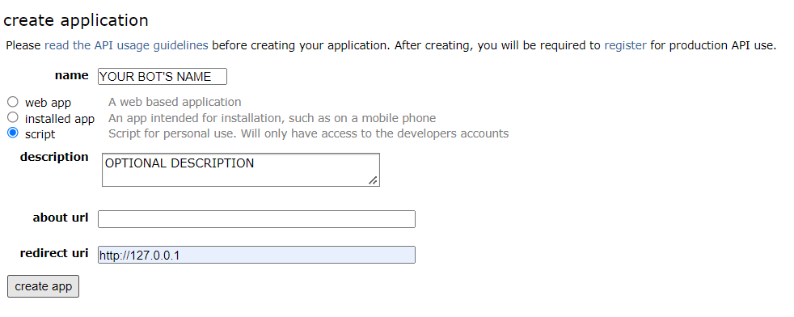
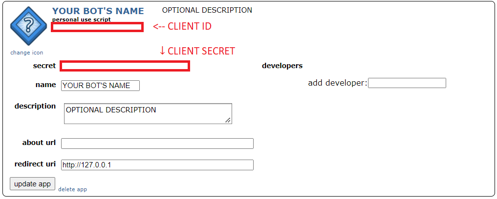

Tentative Reddit Bot for Yugioh cards 

Implemented in Python 3.9 using PRAW 7.5

## Installation

Install the requirements with pip
```
pip install -r requirements.txt
```

Sign into Reddit using the account you want to use to for the bot

Create a Reddit Application using this link (https://www.reddit.com/prefs/apps/) and following the template below


Note down the CLIENT ID and CLIENT SECRET 


Create a .env file in the same folder and set the required environment variables 
```
REDDIT_USERNAME="BOT ACCOUNT USERNAME"
REDDIT_PASSWORD="BOT ACCOUNT PASSWORD"
REDDIT_CLIENT_ID="APPLICATION CLIENT_ID"
REDDIT_CLIENT_SECRET="APPLICATION CLIENT_SECRET"
REDDIT_USER_AGENT="USER_AGENT (a short description of the bot)"
REDDIT_SUBREDDITS="SUBREDDITS (separated by plus signs E.G. botwatch+test)"
```

## Usage

```
python .\replybot.py
```
Go to any of the subreddits entered into the REDDIT_SUBREDDITS field of the .env

Either Comment in a post or create a post with the name of any number of Yu-Gi-Oh cards in either single curly brackets or double curly brackets

## Contributing
Pull requests are welcome. For major changes, please open an issue first to discuss what you would like to change.

## License

[GNU General Public License](https://www.gnu.org/licenses/gpl-3.0.en.html)